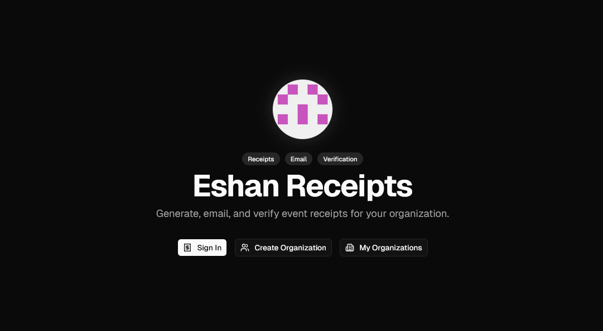
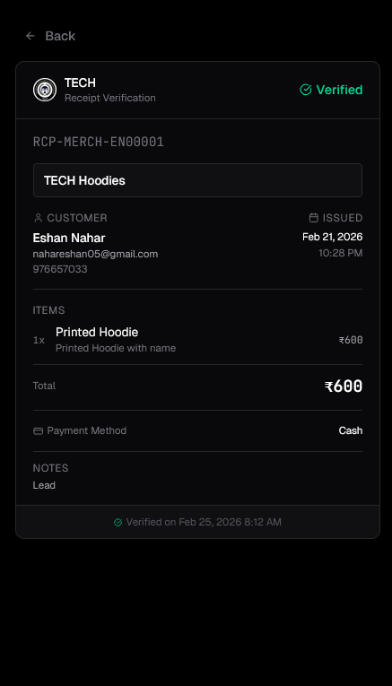
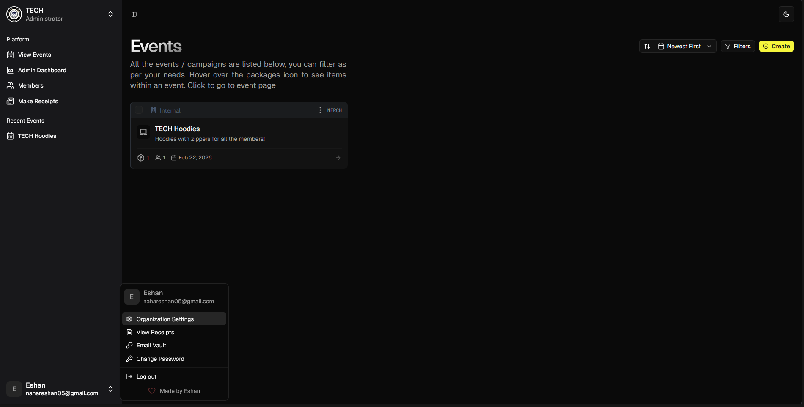
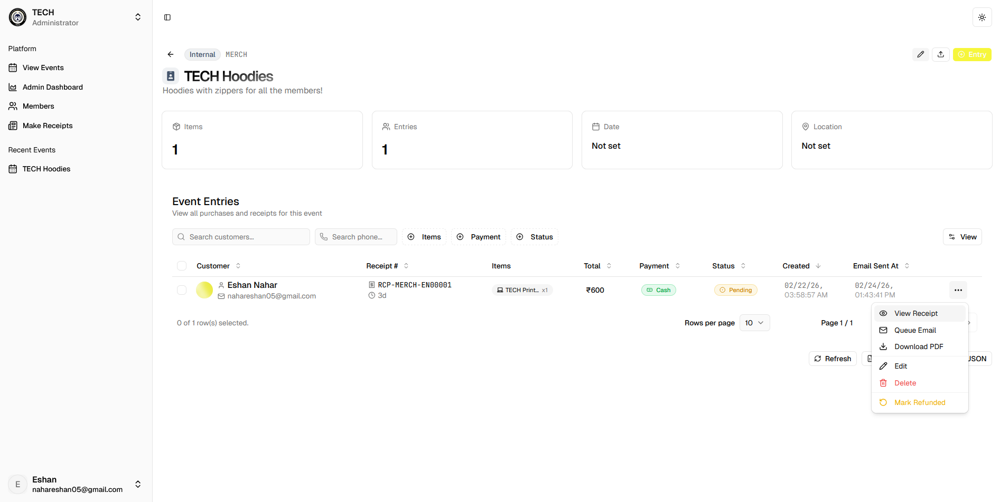
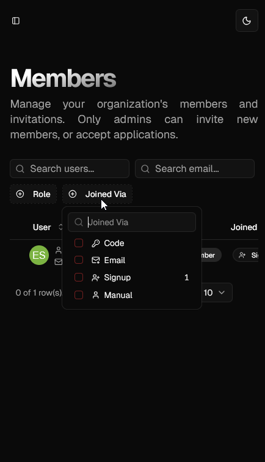

<div align="center">
  <br />
    <a href="#" target="_blank">
      
    </a>
  <br />
  <div>
    
    
    
    
    
  </div>
  <h3 align="center"> Eshan Receipts <br /> Receipt Generator + QR Verification </h3>

   <div align="center">
     Multi-tenant receipt generation and verification platform. Create professional receipts, email them as PDFs, and verify authenticity via QR codes. Built for clubs of all sizes.
    </div>
</div>

## 🍁 Overview

A **multi-tenant receipt generation and verification system** for clubs. Generate professional receipts with customizable templates, automatically email PDF copies to customers, and enable instant verification via embedded QR codes. Features a powerful admin dashboard with event management, member roles, usage tracking, and comprehensive analytics.

### 💻 Technologies

[](https://react.dev/ 'React') [](https://nextjs.org/ 'Next JS') [](https://www.typescriptlang.org/ 'Typescript') [](https://www.mongodb.com/ 'MongoDB') [](https://tailwindcss.com/ 'Tailwind CSS') [](https://vercel.app/ 'Vercel')

- **Language**: TypeScript
- **Frontend**: [Next.js 16](https://nextjs.org/) (App Router) + React 19 + UI Components via [`shadcn/ui`](https://ui.shadcn.com/) + Tailwind v4
- **Backend**: Next.js API Routes + [MongoDB](https://www.mongodb.com/) with Mongoose
- **PDF Generation**: [`@react-pdf/renderer`](https://react-pdf.org/) for server-side PDF rendering
- **Email**: [`react-email`](https://react.email/) for beautiful email templates + Nodemailer/Mailgun
- **QR Codes**: [`qr-code-styling`](https://github.com/kozakdenys/qr-code-styling) + [`@loskir/styled-qr-code-node`](https://github.com/loskir/styled-qr-code-node) for highly customizable QR codes
- **Security**: JWT authentication, bcrypt password hashing, HMAC webhook signatures
- **Caching / Rate Limiting**: [Upstash Redis](https://upstash.com/)
- **Storage**: Backblaze B2 (S3-compatible) for organization assets
- **Charts**: [Recharts](https://recharts.org/) for data visualization

## 🚀 Features

- 🧾 **Generate professional receipts** with customizable templates (minimal, professional, modern, classic, themed). Each receipt gets a unique number and scannable QR code.
- 📧 **Email PDFs automatically** to customers with beautifully designed email templates. Just fill in the details and hit generate!
- 🎨 **Highly customizable QR codes** with dots styling, corner types, custom colors, and logo embedding. Make them match your brand! (WIP)
- ✅ **Receipt verification page** accessible via QR code scan for instant authenticity check. Customers can verify their receipts anytime at `/v/[receipt-number]`.
- 💸 **Refund tracking** with reason recording and status management. Keep track of refunded receipts and why they were refunded in your dashboard
- 📅 **Create and manage events/campaigns** with custom items, pricing, and metadata. Perfect for conferences, workshops, meetups, and more!
- 👥 **Track entries per event** with customer details, items purchased, and payment methods and easily editable
- ⚡ **Bulk operations** - Select multiple events for batch actions like tagging, type changes, or deletion.
- 📥 **CSV import/export** for entries with validation and duplicate detection. Easily migrate or backup your data.
- 🏷️ **Event types and tags** for better organization and filtering. Find what you need quickly.
- 🏢 **Multi-tenant architecture** with complete data isolation per organization. Each organization has its own data, members, and settings. (Separate DB)
- 🎨 **Organization branding** - custom logos, colors, and themes. Make the platform feel like your own!
- 👨‍👩‍👧‍👦 **Member management** with role-based access. Control who can do what.
- ✉️ **Invite system** with join codes and email invitations. Growing your team is just a link away.
- 📊 **Usage quotas** - Events, receipts per month, and user limits. Stay on top of your usage.
- 🔐 **SMTP vault** - Secure storage of organization email credentials with encryption. Your email config, safely stored.
- 📈 **Admin dashboard** with usage overview, limits tracking, and quick actions. See everything at a glance.
- 🛡️ **Superadmin dashboard** for platform-wide management of organizations and users. Full control for platform admins.
- 📝 **Activity logs** for tracking important actions. Know who did what and when.
- 📋 **Real-time data tables** with sorting, filtering, and pagination. Find anything instantly.
- 🔒 **JWT-based authentication** with secure session management. Your account, safely protected.
- 🚦 **Rate limiting** to prevent abuse. Fair usage for everyone.
- 📜 **Audit logging** for sensitive operations. Track every important change.
- ♻️ **Soft deletes** with restore capability. Accidentally deleted something? Bring it back!
- ⚡ **Optimized API endpoints** with caching strategies. Fast and efficient.

## 🤝 Usage

1. **Sign In / Create Account** on the landing page
2. **Create or Join an Organization** - set up your organization or use an invite code
3. **Create Events** - define your campaigns with items and pricing
4. **Generate Receipts**:
   - Select an event
   - Fill customer details (name, email, phone)
   - Add items with quantities
   - Preview and generate receipt
   - PDF is automatically emailed to the customer
5. **Verify Receipts** - Scan QR code or visit `/v/[receipt-number]` to verify authenticity
6. **Manage in Dashboard** - View usage, manage members, configure settings

## ⚙️ Setup

```shell
git clone https://github.com/Eshan05/ACES-Receipts
cd ACES-Receipts
pnpm install
# Configure environment variables (see below)
pnpm dev
```

### Environment Variables

Create a `.env` file with the following variables:

```env
# Database (Atlas)
MONGODB_URI=mongodb://localhost:27017/receipts

# Authentication
JWT_SECRET=your-jwt-secret-here

# Encryption for SMTP credentials
SMTP_VAULT_SECRET=your-encryption-key-here

# Email (Gmail example) (2FA Required)
GMAIL_EMAIL=your-email@gmail.com
GMAIL_APP_PASSWORD=your-app-password

# Application
NEXT_PUBLIC_BASE_URL=http://localhost:3000
NEXT_PUBLIC_DISABLE_SIGNUP=false

# Backblaze B2 (S3-Compatible) for file storage (Free signup)
B2_S3_REGION=
B2_S3_ENDPOINT=
B2_BUCKET=
B2_BUCKET_ID=
B2_ACCESS_KEY_ID=
B2_SECRET_ACCESS_KEY=
```

## 📱 Screenshots

<div align="center">











</div>

## 📄 Additional Notes

- See GPLv3 LICENSE for licensing information
- Feel free to raise issues for bugs or feature requests
- QR codes are highly customizable - see `lib/qr-code.ts` for options
- PDF templates can be found in `lib/templates/`
